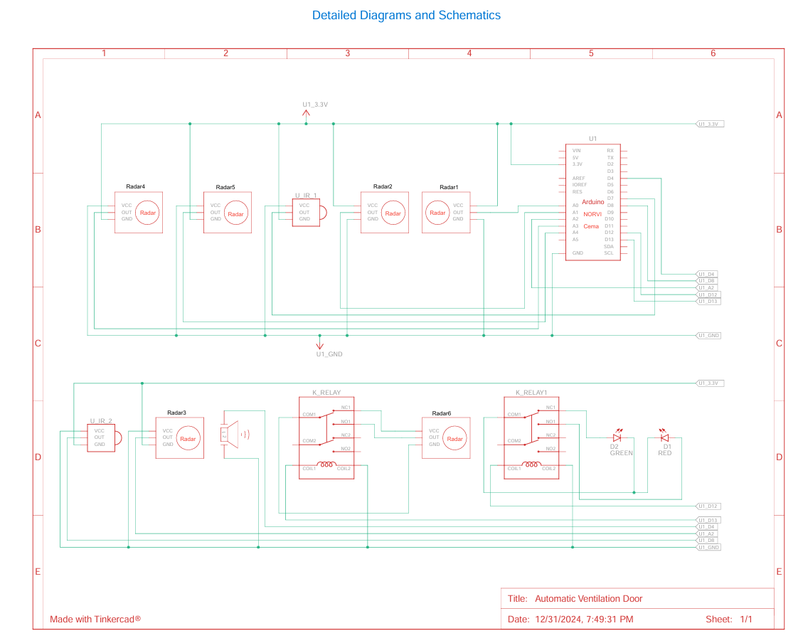

# Automated Mine Ventilation Door - Final Year Design Project

 -orange)

This repository contains the full documentation for my Final Year Design Project at the University of Moratuwa, which focuses on an **enhanced automated mine ventilation door system**.

This project builds upon the foundational work and practical experience gained during my industrial training at Bogala Graphite Lanka PLC. It addresses the limitations of the initial implementation by incorporating industrial-grade components, advanced sensor technology, and a more robust design for improved safety, reliability, and efficiency in underground mining environments.

The complete project report can be found in the `/report` directory.

## Table of Contents
- [Project Evolution](#project-evolution-from-industrial-training-to-fyp)
- [Key Improvements](#key-improvements)
- [System Design](#system-design)
- [Hardware Components](#hardware-components)
- [Software & Control Logic](#software--control-logic)
- [Advanced Safety Features](#advanced-safety-features)
- [License](#license)

## Project Evolution: From Industrial Training to FYP
The initial version, implemented during my industrial training, successfully automated a roller door using basic PIR sensors and an Arduino Uno. While functional, field testing revealed challenges related to sensor reliability (especially for trolleys), controller durability, and installation complexity due to the roller door's crown. This Final Year Project was conceived to systematically address these challenges and engineer a superior, industry-ready solution.

## Key Improvements
This enhanced design introduces several critical upgrades over the original prototype:
- **Optimized Door Mechanism:** Replaced the original **roller door** with a **motorized overhead door**. This eliminates the need for extra rock removal to accommodate a rolling crown, drastically simplifying installation and reducing associated costs.
- **Upgraded Motion Sensing:** Swapped PIR sensors for **RCWL-0516 Microwave Radar Modules**, which offer superior motion detection range and reliability for both personnel and larger objects like trolleys.
- **Industrial-Grade Controller:** Upgraded from the Arduino Uno to the **Arduino NORVI Cema**, a robust, PLC-style controller designed for harsh industrial environments.
- **Enhanced Safety Protocols:** Incorporated designs for mechanical fail-safes like **shear pins** and **breakaway sections** to ensure escape routes remain clear during emergencies like a rock collapse.

## System Design
The system is centered around the Arduino NORVI Cema, which processes inputs from microwave radar sensors for motion detection and IR proximity sensors for obstacle avoidance. It controls the overhead door motor via relays and provides clear visual and audible feedback to workers.

## Hardware Components

| Component                       | Key Function                                          |
| ------------------------------- | ----------------------------------------------------- |
| Motorized Overhead Door         | Double-layer Zinc Alum door for durability & corrosion resistance. |
| Arduino NORVI Cema              | Industrial-grade central controller (PLC).            |
| RCWL-0516 Microwave Radar Module| Primary motion detection for personnel and trolleys.  |
| E18-D80NK Proximity IR Sensor   | Obstacle detection directly under the door's path.    |
| Relay Module                    | Safely switches the high-power door motor circuit.    |
| Indicator Bulbs & Buzzers       | Provide clear visual (Open/Closed) and audible alerts. |
| Uninterruptible Power Supply (UPS)| Ensures continuous operation during power failures.   |

## Software & Control Logic
The control logic, written in C++/Arduino, is designed for reliability and safety. The full source code is available in the `code/` directory.

**Core Logic:**
1.  **Constant Monitoring:** The system continuously checks for signals from the IR obstacle sensors.
2.  **Obstacle Priority:** If an obstacle is detected, all other operations are halted, the door is opened, and an alarm is sounded.
3.  **Motion Detection:** If no obstacles are present, the system monitors the radar sensors. If motion is detected, the door opens.
4.  **Timed Operation:** A delay is programmed to allow passage before the door automatically closes. The green light indicates a fully open state.

## Advanced Safety Features
Beyond basic automation, this design emphasizes safety through:
- **Mechanical Breaker System:** A physical barrier to halt trolleys in case of electronic failure.
- **IP67-Rated Components:** Proposed use of environmentally sealed components to withstand dust and moisture.
- **Redundant Power:** A UPS to prevent system failure during power outages.
- **Manual Overrides:** Physical levers to operate the door by hand in an emergency.

## License
Copyright (c) 2024 S. Suheerman. All Rights Reserved.

This project is protected by copyright law. Please see the [LICENSE](LICENSE) file for details. Unauthorized use, reproduction, or distribution is prohibited without prior written permission.
